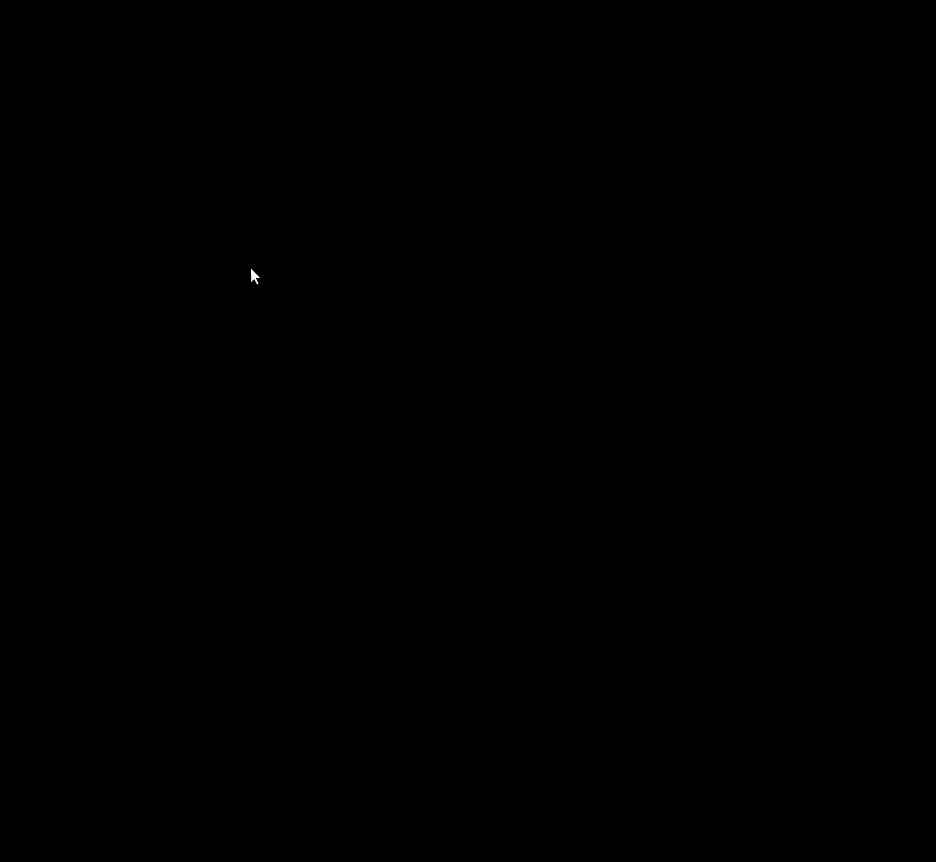
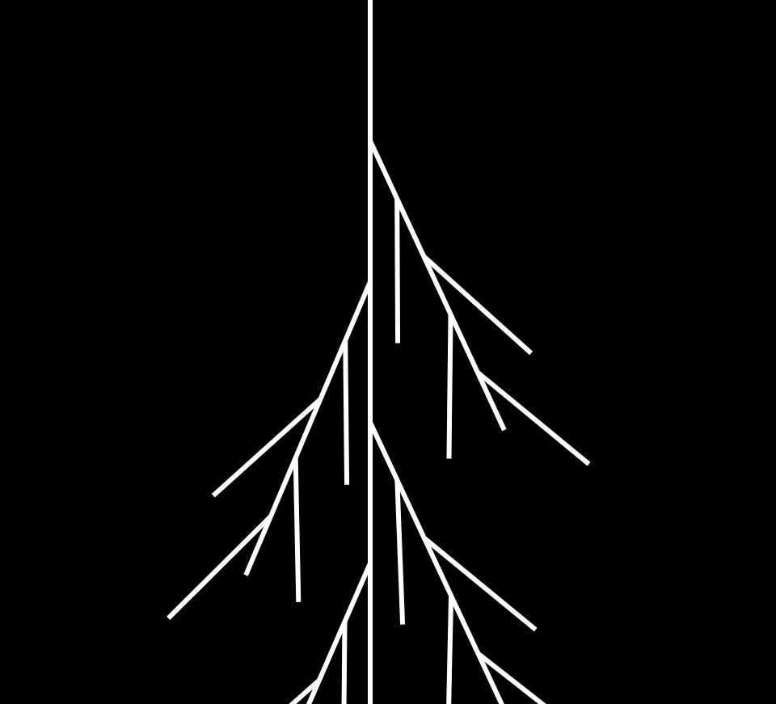
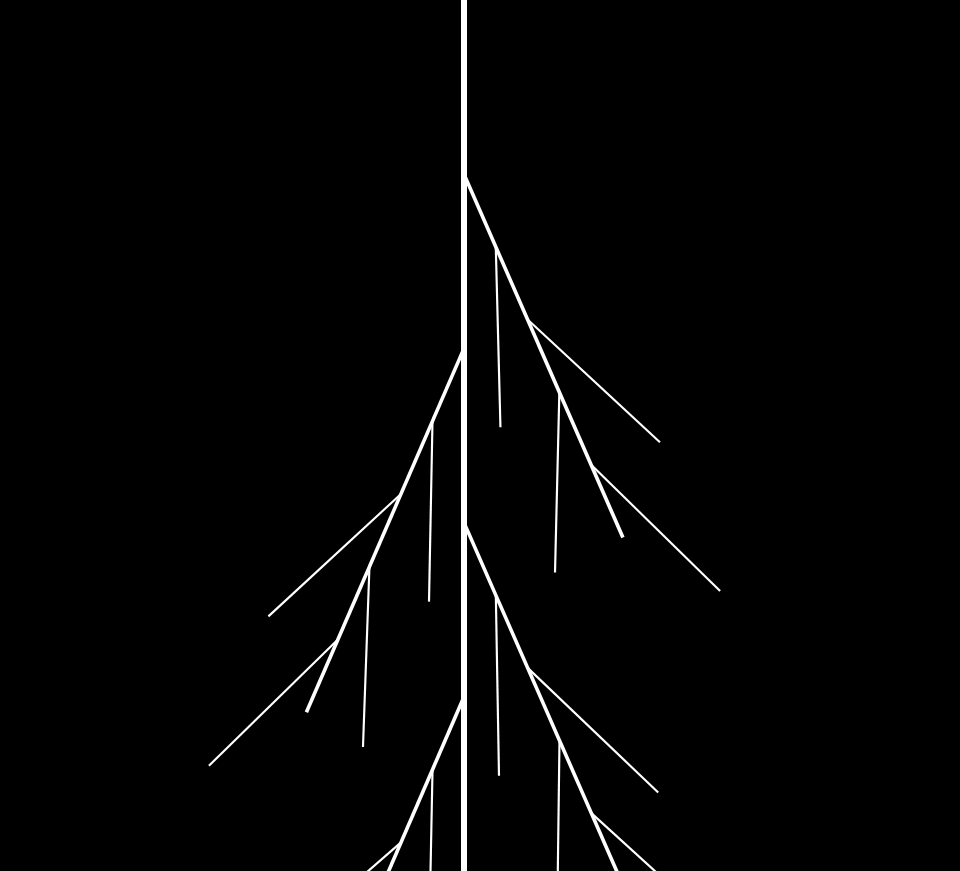
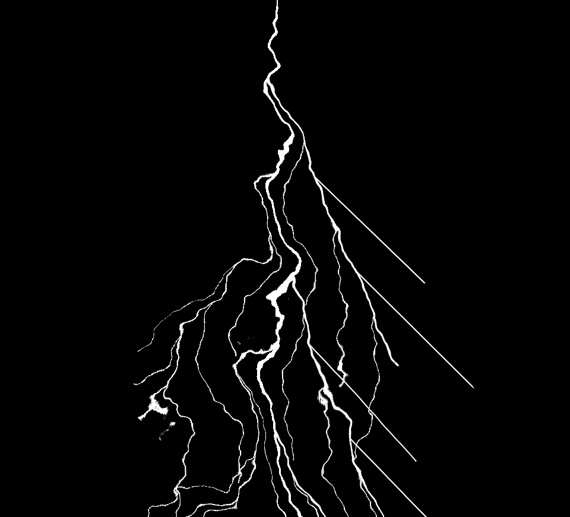
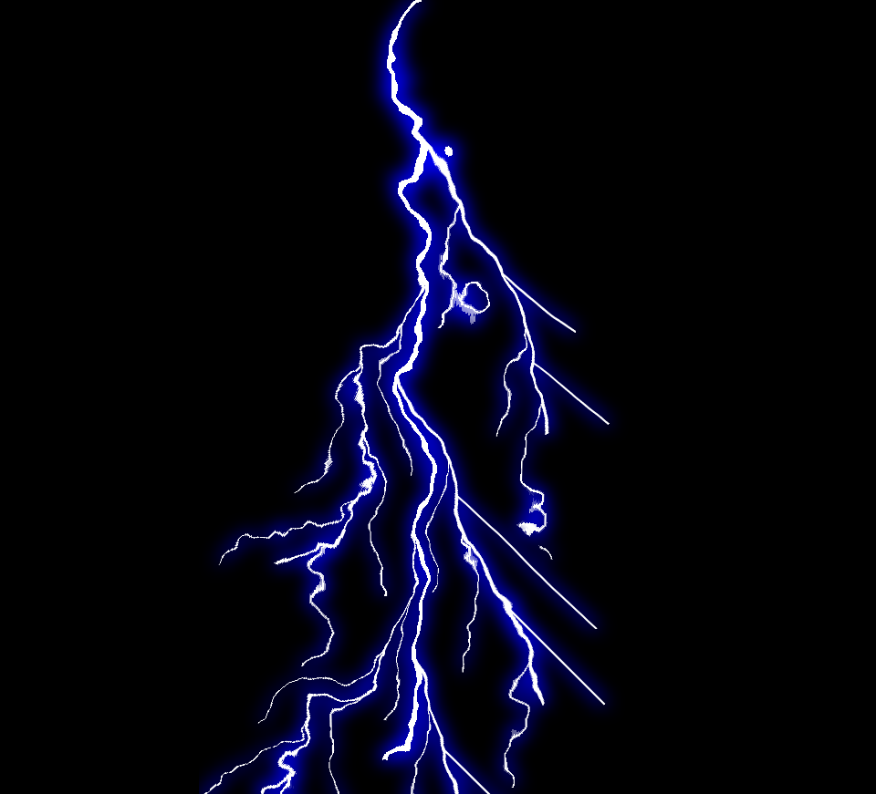

### LIGHTNING GENERATOR

This is a project to generate lightning bolts procedurally. The purpose is to explore options to generate lightning with simple mathematical operations and render it using svg. You can see it live [here](http://se-vel.com/lightning-generator/).

### Inspiration

A lightning bolt can be seen as the root of a plant. At a first glance, there is a main trunk with several branches coming out throughout it. Each branch also have sub-branches and the structure repeats recursively i.e. the structure behaves as a fractal.

Also, each branch seems to follow a semi-chaotic path, it is difficult to see where each one goes, but they have a clear direction: down to soil.

With these ideas, it is time to define the algorithm.

### The algorithm

1. Define a (vertical) line
2. Find the `n - 1` points to evenly divide the line in `n` segments
3. From each of those `n - 1` points start a new line with three characteristics:

- Smaller length (a fraction of the main line)
- Tilted to the main line
- Alternating sides (left - right - left)

4. Start over the process for each new line

The result is seen below

From this point the next steps are focused in adjusting the style to create appealing visuals.

The first improvement is reducing the width of the subsequent branches, just like the length. To do so, we take a fraction of the width of the parent branch.

Now, we need to distort the lines to get that semi-chaotic look and feel.

Then, we add a bit of glow blue to get a colder environment.

Finally, we add a radial gradient at the top of the lightning bolt to light the surrounding area (sky).

### Limitations

Due to the direction of some branches and the nature of the svg filter applied to them, the distortion is not enough to get that semi-chaotic feel in every branch (some of them look too straight). However, this effect is reduced with the speed of the animation.

Since the lightning bolt has to be rendered from top to down, some branches may appear disconnected from their parent.

### Future work (TODO)

- ~~Add thunder sound effect~~
- ~~Add sky~~
- ~~Add landscape~~
- ~~Add UI controls to change lightning parameters~~
- Add clouds
- Improve logic to make the directions of branches more diverse.
